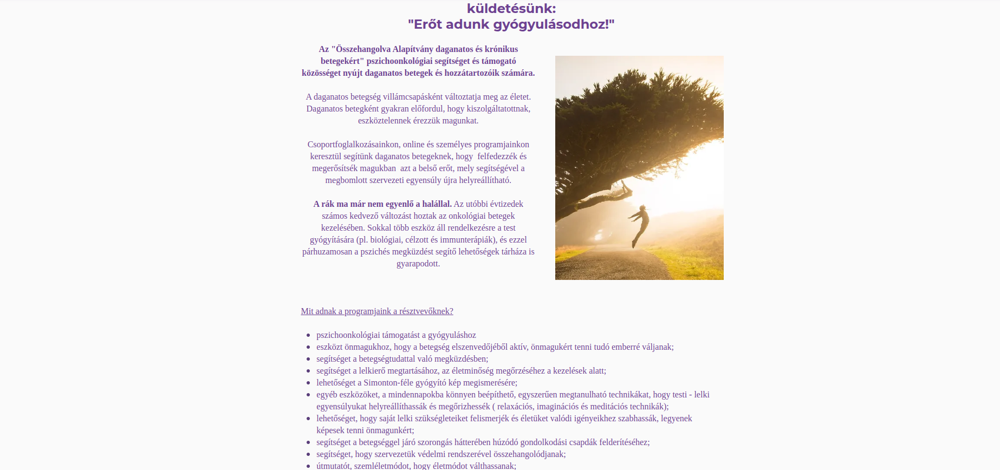
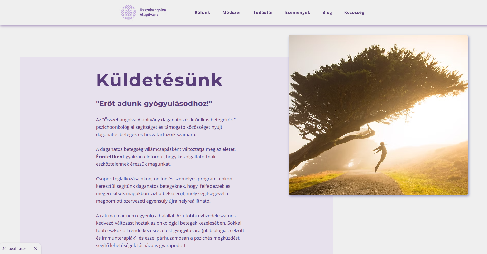
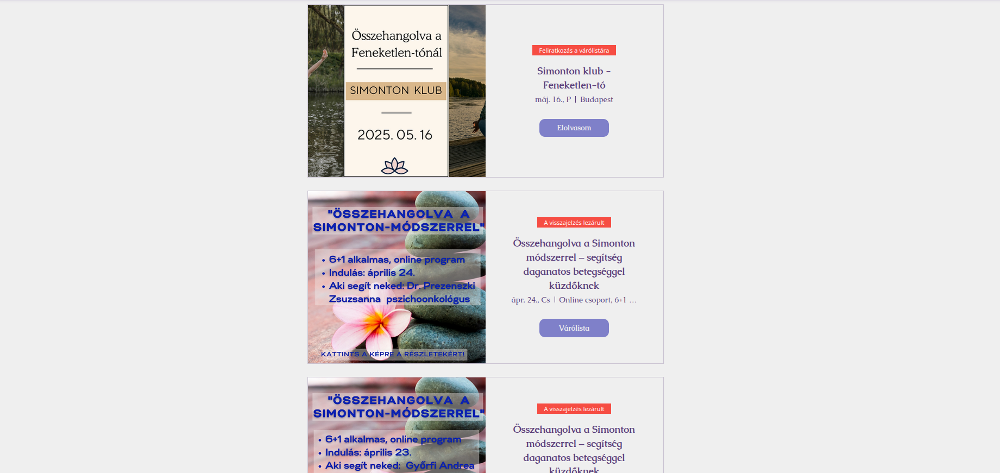
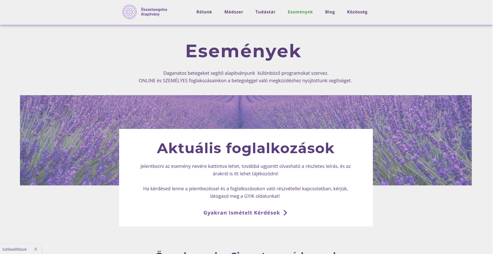
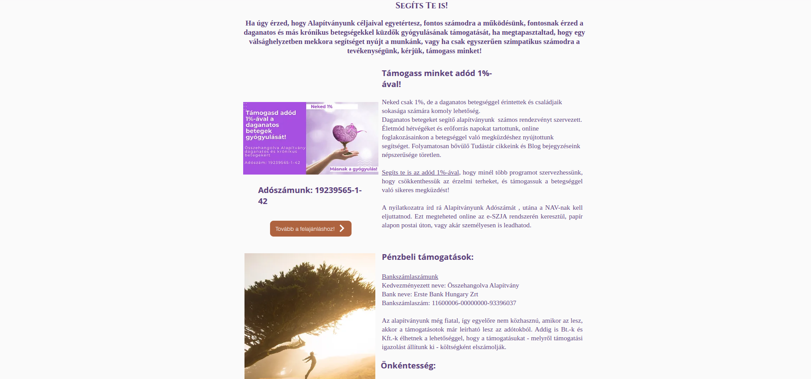
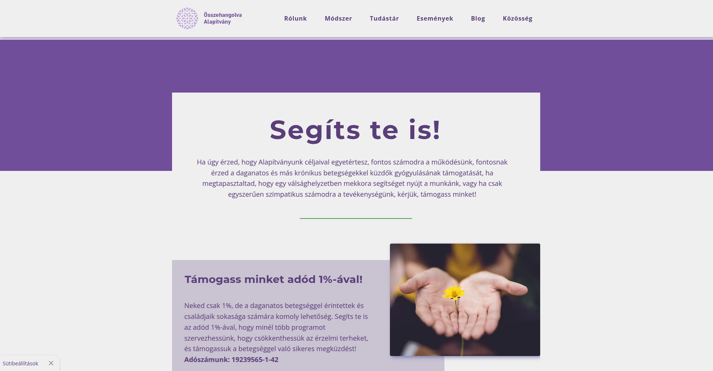
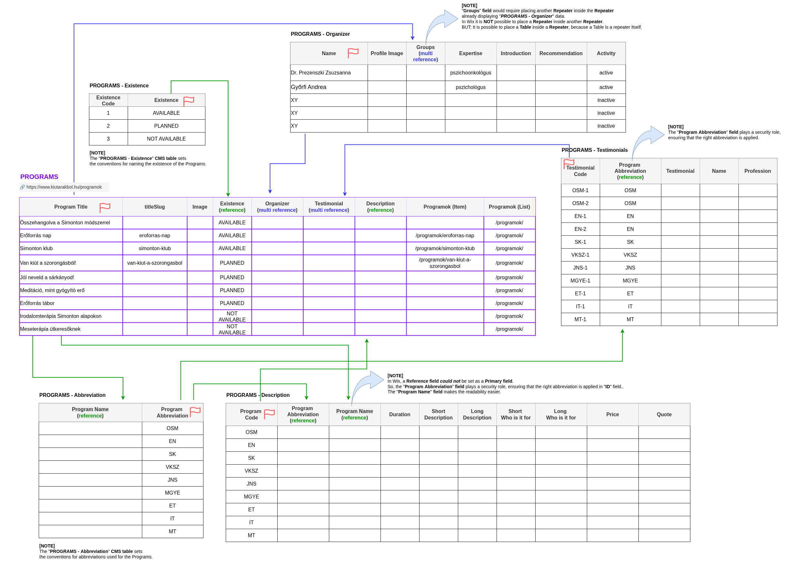

# Hungarian Nonprofit Organization – Wix Website Reconstruction

This repository contains custom **Wix Velo** code used for the reconstruction of a Hungarian nonprofit organization's website – [Összehangolva Alapítvány](https://www.kiutarakbol.hu) – during the Spring of 2025.

The story of this reconstruction is detailed in the **LinkedIn article**:  
👉 **[Not Just a Website: Building a Scalable Digital Backbone for a Nonprofit Team](https://www.linkedin.com/pulse/just-website-building-scalable-digital-backbone-nonprofit-nemeth-jgnke/)**

The site is built with the **Wix Editor** (not Wix Studio) and enhanced with **Velo by Wix** to enable dynamic behavior, CMS-driven content, and custom logic.

This repository provides insights into the technical structure, backend logic, and automation workflows implemented in the project.

---

## 📑 Table of Contents

- [Setup and Overview](#setup-and-overview)
- [Visual Comparison: Before and After](#visual-comparison-before-and-after)
- [CMS Structure: Modular and Scalable Design for Programs](#cms-structure-modular-and-scalable-design-for-programs)
- [How CMS Integration Works](#how-cms-integration-works)
- [Velo Code Features](#velo-code-features)
- [Key Code Locations](#key-code-locations)
- [Why Not Use Repeaters for Testimonials?](#why-not-use-repeaters-for-testimonials)
- [Responsive Design in Wix Editor](#responsive-design-in-wix-editor)

---

## 📌 Setup and Overview

- **Platform:** [Wix Editor](https://www.wix.com/) (Classic Editor, not Wix Studio)
- **Custom Code Tool:** [Velo by Wix](https://dev.wix.com/docs/velo)
- **Live Website:** [https://www.kiutarakbol.hu](https://www.kiutarakbol.hu)

### Technical Notes

- All custom code is written directly in the **Wix Editor's IDE** after **Dev Mode** is enabled.
- `console.log()` and `console.error()` are used for in-browser debugging.

---

## 🖼️ Visual Comparison: Before and After

These screenshots document key changes made during the website revamp. While visual updates were included, the main focus was on **clarifying the content, reorganizing the structure**, and **making navigation intuitive and accessible**.

The updated site balances **usability and information density**, maintaining necessary complexity while adopting a more **modular and logical structure**.

As a **full-stack developer**, I'm more focused on **systemic clarity** than artistic design. I value **clear logic, maintainable structure, and purposeful flow** over aesthetics alone—though I aim to create harmonious interfaces when possible.

| Old Version                                              | New Version                                              |
| -------------------------------------------------------- | -------------------------------------------------------- |
|              |              |
|        |        |
|          |          |
|  |  |

---

## 🧱 CMS Structure: Modular and Scalable Design for Programs

To ensure data consistency, easier maintenance, and flexibility, the `Programs` CMS structure is intentionally split across multiple interlinked CMS tables:

### Why modular CMS tables?

- **Avoid redundancy**: Repeated fields like _Existence_ status, _Program Abbreviations_, or _Organizer_ would lead to copy-paste errors if stored directly in every Program item.
- **Ensure consistency**: Changes (e.g., renaming a program or updating its status) propagate automatically across all referencing views (pages, lightboxes).
- **Enable flexible relationships**:
  - A program can have multiple testimonials.
  - Team members can be linked to one or more programs via multi-reference fields.
- **Maintain clarity**: Detailed program descriptions and additional info are stored separately, making the main `Programs` table lean and readable.

### Key CMS Tables and Their Roles

- **Programs**: Core information (title, image, slugs), linked to all other collections.
- **Existence**: Defines reusable program status labels like “Available” or “Planned”.
- **Organizer**: Stores team member bios and roles; used in the lightbox and on the dynamic program pages.
- **Testimonials**: Connected back to `Programs` via multi-reference; shown on testimonial sliders.
- **Description**: Stores long/short descriptions and audience info, tied to each Program Abbreviation.
- **Abbreviation**: Ensures consistent program identifiers and references across tables.

ℹ️ Note: This approach follows relational data principles within Wix`s CMS limitations — optimizing for maintainability and data clarity.



### Note on Primary Fields and Referenced Fields in Wix CMS

Wix CMS does **not allow referenced fields to be used as Primary Fields**.

In Wix:

- A **Primary Field** is used to identify each item uniquely in the editor and Velo code (e.g., in repeaters).
- **Referenced fields** are not considered stable or unique enough to serve that role, because they point to another collection's item and are **_not plain values_**.

So even if a referenced field contains a unique value in practice (like a Program Name), Wix won't allow it to be set as the primary key for display or query purposes.

In contrast, **relational databases (like MySQL or PostgreSQL)** allow to make a **foreign key** (reference to another table) part of the **primary key** — for example, in a **composite primary key**. But:

- The referenced value must itself be unique.
- It's usually combined with another field (e.g., `program_id` + `language_code`) to ensure uniqueness.

However, Wix's CMS is optimized for simplicity and does not support such advanced database constructs.

## 🔌 How CMS Integration Works

### COLLECTION_ID

- This is the **ID of a CMS collection (also called a database or content table)** in your site.
- When **Dev Mode** is **enabled**, click the **Database icon** (on the left sidebar in the Editor) to view your CMS tables.
- Under each table name, you'll see the **Collection ID**.
- You use it in code with `wixData.query()`, `wixData.queryReferenced()`, etc. to refer to a specific collection.

Example:
If you have a table named TeamMembers, the Collection ID might be:

```js
wixData.query('TeamMembers');
```

### DATASET_ID

- This is the ID of a **Dataset element** that connects a **CMS collection** to page elements (text, images, repeaters, etc.).
- You add a dataset to a page via the **_Add Panel > CMS > Dataset_**, then connect it to a collection.
- When you connect a CMS collection to a page via a Dataset, the dataset gets a unique ID like `"myDataset"`.
- When you select the dataset on the page, you'll find its ID in the Properties Panel — e.g. `#myDataset`.

In code, you use it like:

```js
$w("#myDataset").onReady(() => { ... });
```

The screenshot below shows where you can find the IDs for Collections and Datasets in your Wix Editor:


### Multi-Reference Field Lookup

- `queryReferenced()` fetches related items (e.g., team member → groups)
- `hasSome()` enables **reverse lookup** (e.g., testimonial → program)

📚 **Learn more**:

- [Querying Items that Reference Other Items](https://dev.wix.com/docs/develop-websites/articles/databases/wix-data/reference-fields/querying-items-that-reference-other-items)
- [Query Referenced Items](https://dev.wix.com/docs/velo/apis/wix-data/query-referenced)

---

## 🛠️ Velo Code Features

📚 **Full API Reference**: [Velo API Reference](https://www.wix.com/velo/reference/api-overview/introduction)

Custom Velo logic is used to enhance UX and manage CMS-based content dynamically:

- **Lightboxes**  
  Dynamic lightboxes populated using `wixWindow.openLightbox()` with contextual data.
- **Data Queries**  
  Uses `wix-data` to:

  - Query CMS collections
  - Filter dynamic datasets
  - Retrieve referenced items via multi-reference fields

- **Repeaters & Datasets**

  - Custom rendering logic via `.onItemReady()`
  - Conditional display (e.g., hide/show buttons or images)

  📚 **Reference**: [Working with Repeaters](https://www.wix.com/velo/reference/$w/repeater/onitemready)

- **Routing & Filtering**
  - Page-level logic to dynamically show/hide content depending on URL path (e.g., filtering CMS categories)

---

## 📁 Key Code Locations

### Pages with Custom Velo Code

- `/programok`:  
  Organizer lightbox interaction & CMS multi-reference query
- `/tudastar/[slug]`:  
  Filtering category buttons depending on the current path
- `/esemenyek`:
  Displays team member lightbox with dynamically loaded groups using `queryReferenced`,
  and auto-populates multiple testimonial slides from CMS.
  Also performs a reverse lookup on multi-reference fields (from "Programs") to retrieve related program titles.
- `/blog`:  
  Collapsing the hero section on category/tag pages via URL inspection
- `/segits-te-is`:  
   Button & image visibility based on item data

### Lightboxes

- **`OrganizerLightbox`**:  
  Displays team member details along with dynamically loaded groups (multi-reference field)

### Global Custom CSS

- Injected via **Dashboard → Settings → Custom Code**
- Adjusts typography and hover styles
- Improves mobile responsiveness for text and buttons

---

## 🙅 Why Not Use Repeaters for Testimonials?

My goal was **to display testimonials on individual slides**, keeping the **same clean design for each slide** but **pulling the content dynamically from a CMS table**. Managing testimonials in the CMS makes it easy to update content without touching the code or page design.

While repeaters are perfect for listing multiple items with a shared layout, they don't fit well when you want to:

- Precisely control which testimonial appears on each specific slide,
- Reuse the entire testimonial section easily across different pages without embedding static content on each page.

By managing each slide's content individually in the code, I can dynamically load CMS data and still have full control over slide behavior, animations, and layout. Plus, this method lets me place the testimonial section anywhere across the site and simply update the CMS table — no need to copy-paste testimonials on multiple pages.

This approach combines the power of CMS-driven content with the flexibility of a custom slideshow, making it easy to maintain and scalable as the site grows.

---

## 📱 Responsive Design in Wix Editor

Wix Editor provides two main breakpoints:

- **Desktop View**
- **Mobile View**

### Tablet Support

Wix **does not offer a separate tablet editor** in the Classic Wix Editor.  
📚 See: [Feature Request](https://support.wix.com/en/article/wix-editor-request-designing-a-tablet-specific-version-of-your-site)

- Most tablets load the **desktop version** in landscape, and the **mobile version** in portrait, based on screen resolution.
- There is **no manual tablet view** customization.
- Layout issues may occur if:
  - Elements are absolutely positioned or fixed-width
  - Containers are not stacked or grouped responsively

📚 More info: [Wix iPad and Tablet Support](https://support.wix.com/en/article/troubleshooting-ipad-and-tablet-live-site-issues)
